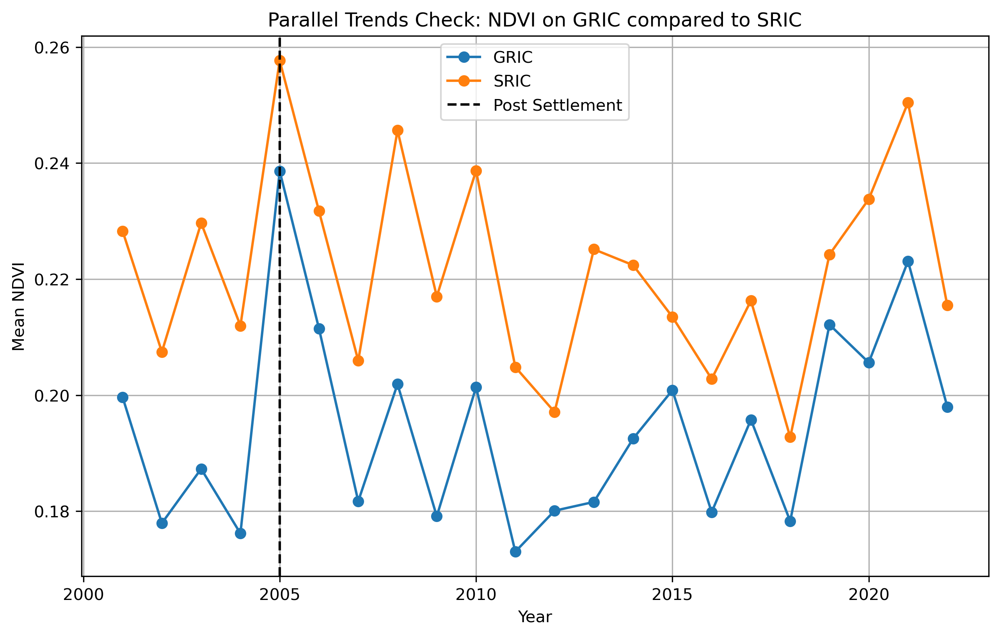

### Welcome! I am currently working towards my MS in Applied Mathematics at the University of Colorado Boulder, with a focus on statistics and data analytics applications to the physical sciences. Some of the projects I have worked on in Earth Data Analytics are listed below with workflows linked for further detail. ###

---
### Modeling Asthma Rates in Chicago with Income and Vegetation Data

  <iframe src="img/descrip_asthma_error_map.html" style="width: 100%; height: 100%; border: none;"></iframe>

For an assignment, I built a multiple linear regression model comparing various vegetation statistics to adult asthma rates by census tract in Chicago, IL. Vegetation data is found using [NAIP](https://naip-usdaonline.hub.arcgis.com/) satellite imagery to find NDVI values and calculate various measures. the [CDC Places](https://www.cdc.gov/places/index.html) dataset has measures on asthma rates at the tract level, and income data comes from the 5-Year American Community Survey from the [Census Bureau](https://www.census.gov/data/developers/data-sets/acs-5year.html). While looking at the satellite imagery of Chicago, the major highway systems really stood out, but I couldn't determine much about the distribution of green spaces yet. I was partially aware from previous work, but [Bagagli](https://www.graduateinstitute.ch/sites/internet/files/2025-02/chicago_0130_lowres.pdf) and [Weiwu](https://economics.ucdavis.edu/sites/g/files/dgvnsk13091/files/inline-files/Weiwu.pdf) have both written about the extent to which the construction of the interstate highway system further deepened racial divides as minority communities were often the ones disrupted and relocated to build the multi-lane roads. [Aaronson et al.](https://pubs.aeaweb.org/doi/pdfplus/10.1257/pol.20190414) among others have written about redlining which has a long history of division in Chicago as well as certain minority communities were denied access to credit and housing. 

I hypothesized that these structural inequalities would indicate that the accessibility and quality of greenspace in Chicago is relatively similar to healthcare access and air quality represented by asthma rates. However, when calculating a model using solely vegetation and asthma rates, I found a very weak R2 value of 0.091. With the addition of median household income data, I was able to bring the R2 value up to 0.546, which is a substantial improvement. I would like to add a measure of proximity to neighboring green spaces as well, but that has not been implemented yet. [Read more about the process here](projects/greenspace_portfolio.html).

### Analyzing Vegetation Levels in the Gila River Indian Community

  <iframe src="img/ndvi_diff_plot_new.html" style="width: 100%; height: 100%; border: none;"></iframe>

In 2004, the Arizona Water Settlements Act took a major step in compensating for over a century of injustice concerning the water rights of the Gila River Indian Community south of Phoenix. Established in 1859 as the first reservation in Arizona, the GRIC quickly began seeing Gila River flows diminished due to upstream dams and diversions which put historic agricultural lands and practices at risk. For decades, Tribal leaders engaged federal and state lawmakers in an effort to restore and secure sufficient water access for their people, but progress was slow. The GRIC [website](https://www.gilariver.org/index.php/about/history) and the First Nations Development Institute [case study](https://www.firstnations.org/wp-content/uploads/publication-attachments/2009_NAAW_Rethinking_Asset_Building_Case_1.pdf) on the region provide a much more detailed history. The full 2004 settlement is also available [online](https://www.congress.gov/108/plaws/publ451/PLAW-108publ451.pdf). 

In order to track improvements and changes within the GRIC post settlement, I set up the above plot to compare the Normalized Difference Vegetation Index (NDVI) values of each year after 2004 to average values for the three years prior. The most concentrated change between 2005 and 2022 appears near the middle of the map around coordinates (-111.8, 33.2) which appear to be agricultural efforts. Slightly below, there is an area in the lower central area of the GRIC that has gone in the negative direction, but I can tell from the GRIC safety [website](https://www.gricsafety.org/index.php/fire-department/station-location-and-response-area) that is likely due to the growing development. Overall, there seems to be some improvement in NDVI values across the GRIC, but the urban growth of Phoenix and areas surrounding the GRIC make comparing the rates of change inside vs outside of the boundary more difficult. [Read more about the process here](projects/vegetation-project.html).

### Looking Further into Gila River NDVI compared to neighboring Salt River Indian Community

  <iframe src="img/overview_plot.html" style="width: 100%; height: 100%; border: none;"></iframe>

In an effort to further understand the impact of the 2004 settlement restoring water rights to the Gila River Indian Community, I set up a difference in difference comparison between NDVI values for the Gila River and Salt River Indian Communities from 2002-2022 using 2005 as a break point. As the map above shows, both the GRIC and SRIC are located outside of present-day Phoenix, AZ and have river access to their namesake waters. The people of the Salt River and Gila River share common history, ancestors, and traditions, with the Salt River Reservation established in 1879, 20 years after the Gila River to the south, due to increased migration from the GRIC as their river continued to dry up from non-native dams and diversions. The [SRIC](https://srpmic-nsn.gov/about/history/) and [GRIC](https://www.gilariver.org/index.php/about/history) keep strong histories. 

For decades, both the GRIC and SRIC fought legal battles with the federal government as their rivers dried, but due to the smaller land size and relatively less far-reaching implications, the SRIC was able to reach a water rights [settlement](https://open.uapress.arizona.edu/read/dc19d40e-ae7d-4010-a72b-337de7467d64/section/fd79c1c1-d802-403e-a696-fc863e7b5fa1#id_224) in 1988, well before the 2004 settlement impacting the GRIC. For all of these reasons, we should see similar climate and annual trends between the GRIC and SRIC prior to the 2004 settlement primarily affecting the GRIC. The data supports the prior trends assumption on an eye-test level, but in hindsight a longer lead time on both datasets could have been helpful.

  

Next I ran the DiD analysis, which should identify what, if any, effect the 2004 settlement might have had when annual trends and patterns present in both datasets are removed. Unfortunately, those annual trends, particularly in climate variability, have a large impact on vegetation growth annually and can overshadow any improvement due to water flow. Additionally increased development in the GRIC as downtown has grown would downwardly bias the mean values. The treated:post = .0085 which while positive is very weak on a 0-1 scale. 

  <iframe src="img/did_model_summary.html" style="width: 100%; height: 100%; border: none;"></iframe>

I have not solved how to fully mask out human development and isolate as much 'pure' vegetation as possible, but I have expanded on the last project as a step in that direction. I modified the NDVI sliding plot to now calculate a running average of NDVI values from 2005 to the year selected as compared to mean values for 2002-2004. Calculating a running average helps smooth out the data more and really highlight areas where NDVI has been consistently changing in the same direction. 

  <iframe src="img/gric_avg_diff_plot.html" style="width: 100%; height: 100%; border: none;"></iframe>

The restoration of water right from the settlement has certainly led to [improvement](https://nativesciencereport.org/2021/12/bringing-a-river-back-to-life/#:~:text=At%20a%202015%20conference%20on,segment%20of%20the%20Gila%20River.) for the local communities, and overcoming challenges to quantify those benefits helps justify similar actions elsewhere. [Read more about the process and potential next steps here](projects/gric_sric_project.html).

----------
<!--
## About Me ##
WIP
-->

  
### Contact ###
* Email - <Charlie.Caravati@colorado.edu>
* GitHub - [cmcara](https://github.com/cmcara)
