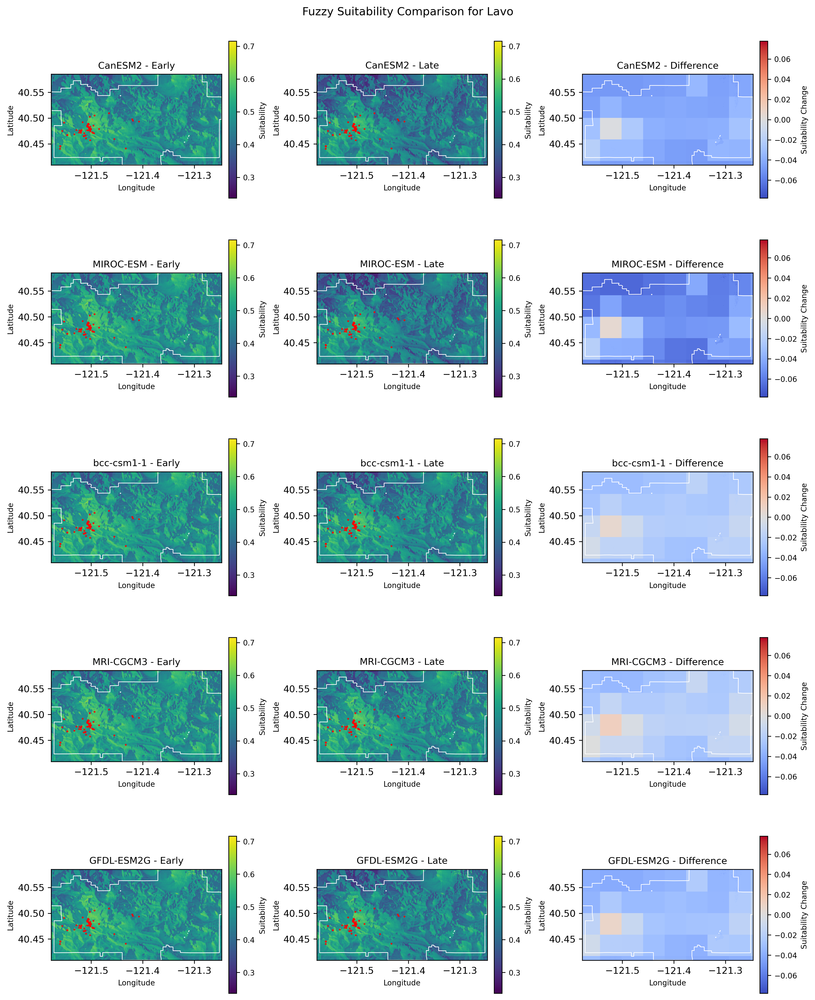
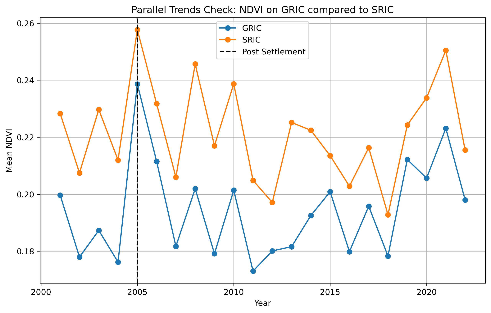

### Welcome! I am currently working towards my MS in Applied Mathematics at the University of Colorado Boulder, with a focus on statistics and data analytics applications to the physical sciences. Some of the projects I have worked on in Earth Data Analytics are listed below with workflows linked for further detail. ###
---

### High Resolution Clustering with NEON LiDAR and Reflectance

  
  

    <iframe src="img/RMNP_Zoom_Cluster.html" style="width: 100%; height: 100%; border: none;"></iframe>
  

  

    <iframe src="img/RMNP_CHM_Tile_Map.html" style="width: 100%; height: 100%; border: none;"></iframe>
  

The [National Ecological Observatory Network](https://www.neonscience.org/) as part of the NSF collects truly massive amounts of data including biological, atmospheric, hydrologic and geographic measurements and observations. This information is collected at incredibly high resolution through specialized equipment and, although data is limited to NEON observation sites, can provide insights at a much more granular level if it can be processed properly. This workflow is particularly concerned with LiDAR and multi-spectral reflectance data, both of which are collected and published as raw data and derived products. To save on complexity and storage demands, I utilize NEON-calculated data for the Canopy Height Model and the Normalized Difference Vegetation Index (a measure of vegetation health) and calculate slope and aspect (slope direction) from the Digital Terrain Model elevation data. My initial work focusses on the heavily forested and mountainous Rocky Mountain National Park but can be modified for any NEON site with sufficient data, and I am in the processing of improving the workflow to better suit the wide range of data products NEON has to offer. Workflows for downloading and processing different datasets are similar but have individual quirks to watch out for.

  <iframe src="img/RMNP_Cluster_Table.html" style="width: 100%; height: 100%; border: none;"></iframe>

With data for NDVI, CHM, slope, northness, eastness, and elevation collected and merged across the RMNP site, I began harmonizing and scaling the data for analysis. Re-sizing the data to mean of zero and standard deviation of one is crucial with data of such vastly different scales. From a basic multiple linear regression with NDVI as the response, tree height represented as the CHM unsurprisingly was most positively correlated with vegetation health for a given pixel in the RMNP. With an R2 of .212, the overall regression is not very strong, but hints at one of the more interesting takeaways from this analysis: northness is positively correlated with NDVI. Given the northern hemisphere location, I figured southern facing slopes would receive more sunlight and thus be healthier, but the data will repeatedly suggest northern facing trees to be healthier in terms of NDVI. According to the [USGS](https://www.usgs.gov/geology-and-ecology-of-national-parks/ecology-rocky-mountain-national-park), "north-facing slopes are not subject to the same strong, drying sunlight as the south-facing slopes and therefore, the north’s soils contain more available water." Grasses and plant are more likely to flourish on south-facing slopes as well, while competition from other species might be less fierce on the shaded slopes that provide refuge for trees tall enough to still receive enough sun. As the data also suggested substantial structural issues with an OLS regression model and not wanting to implement a more advanced generalized linear model, I decided to move towards classification clustering instead.

  <iframe src="img/RMNP_Cluster_Map.html" style="width: 100%; height: 100%; border: none;"></iframe>

Classification is one the primary [use cases](https://learn.microsoft.com/en-us/dotnet/machine-learning/resources/tasks) for machine learning algorithms. Unsupervised learning allows the implementation of these advanced strategies without labelled or training data but comes with potential weaknesses, particularly in inference. In a previous k-means project detailed below, comparing the clustering of two different regions is difficult as the algorithm likely found different arrangements of centroids in the data and sorted clusters slightly differently. By calculating and outputting centroid means in a similar way after the algorithm has done its job, I can much better understand the groupings. A key difference for this workflow was the implementation of a batch-processing k-means algorithm and chunking throughout which was necessary given the final scaled pre-processing data had 181,562,988 x 8 entries. Including the cluster means for each variable adds a lot of context to the plot and allows for a peak behind the curtain of the algorithm to see where groups stand out. For my earlier regression, I scaled all of the feature variables but left NDVI unscaled to make inference easier. When first calculating clusters, I accidentally left NDVI unscaled which downplayed its grouping effect the first few times. After catching the mistake, rearranging the groupings to descending NDVI order, plotting from green to red, and increasing the algorithm hyper-parameters, the plot really begins to take shape. The cluster map above is at a low resolution for web-viewing but the full plot in code picks out individual plants and structures including roads and rivers. The tile version provides an example of the increased resolution without plotting the full area. [Read more about the process here](projects/RMNP_lidar_clustering.html).

---
### Whitebark Pine Habitat Suitability with Fuzzy Logic

  

Despite being listed as a threatened species by the FWS in [2022](https://www.fws.gov/species/whitebark-pine-pinus-albicaulis), the whitebark pine (*Apinus albicaulis*) is incredibly resilient and serves as a [pioneer species, a keystone species, and a foundation species](https://whitebarkfound.org/about/why-does-whitebark-pine-matter/). Whitebark seeds are almost entirely spread by Clark's nutcrackers, who rip the cones apart and dislodge the seeds, which are then carried by the wind or stashed in one of many nutcracker burrows to be forgotten about for years ([NRCS](https://www.nrcs.usda.gov/plantmaterials/idpmcpg10870.pdf)). White pine blister rust and mountain pine beetles have been major threats to the whitebark pine species leading to the spread of [ghost forests](https://www.conifers.org/pi/Pinus_albicaulis.php) where skeletal tree dot the landscapes, but the hearty pines continue to return and grow old enough to produce cones and continue the cycle.

As higher temperatures rise to higher elevations, the whitebark pine is also being crowded out by other species typical of lower elevations and higher shade tolerance, which the whitebark pine does not [possess](https://www.nrcs.usda.gov/plantmaterials/idpmcpg10870.pdf). Mountains in the western U.S. are tall by most standards, but eventually the peak region cannot support consistent soil or plant habitat (particularly for trees) as the slope becomes too sheer and rocky. Despite efforts to manage habitat, invasive threats, and crowding species, is there a chance we could simply lose sufficient space for species like whitebark if temperatures rise significantly in peak areas? To what degree will the height of the peaks make a difference? To begin attempting to answer questions like these, I developed a workflow for a habitat suitability model that incorporates soil (sand, organic material) and topography (elevation, slope, aspect) values for the study sites with climate predictions (max/min temp, precipitation) across a number of models. 

  

For this example, I focused on the mountain peaks in the Lassen and Shasta National Forests in California. Mount Shasta is nearly 4,000 feet taller than Lassen Peak, but both protected areas are key whitebark pine habitats. Across all climate models and sites, I was surprised at the extent to which both peaks saw improved suitability. I expected the higher elevation peaks to be the least impacted but was not anticipating an increase. The MIROC-ESM model was chosen as the 'hottest' of the climate models and clearly stands out as the most negatively impacted across both sites which lines up with expectations, but the peaks still see a positive increase in suitability. One of both of these could result from misalignment in my optimal and tolerance values, which can be easily adjusted from research. Fortunately, both peak regions in Shasta see either a gain or minimal loss, but whitebark pine on the smaller, left peak could be at risk much earlier than the main peak. [Read more about the process here](projects/habitat_suitability_portfolio.pdf).

---
### K-Means Optimization in Land Cover Classification

  <iframe src="img/elbow_output_080902030501.html" style="width: 100%; height: 100%; border: none;"></iframe>

  <iframe src="img/kmeans_output_080902030501.html" style="width: 100%; height: 100%; border: none;"></iframe>

  <iframe src="img/elbow_output_080902030502.html" style="width: 100%; height: 100%; border: none;"></iframe>

  <iframe src="img/kmeans_output_080902030502.html" style="width: 100%; height: 100%; border: none;"></iframe>

Unsupervised machine learning algorithms have a numer of [use](https://www.sciencedirect.com/science/article/pii/S1877050925012852) [cases](https://agupubs.onlinelibrary.wiley.com/doi/full/10.1029/2018EA000519) in earth sciences, though the lack of labelled training data can make inference more difficult. [K-means clustering](https://en.wikipedia.org/wiki/K-means_clustering) applies an algorithm to group data into k different 'clusters' of similar values, but without some testing, the optimal number of clusters can be difficult to determine. The elbow method compares the inetrtia (defined as the sum of squared differences) for each k clusters, but inertia will always decrease with more clusters. By locating the 'elbow' where we start seeing a smaller decrease in inertia as we increase cluters, we can identify the k number of clusters that offers the best tradeoff.

  <iframe src="img/HUC12_borders.html" style="width: 100%; height: 100%; border: none;"></iframe>

My original area of focus was wetlands in the Mississippi Delta south of New Orleans, and I first wanted to compare HUC12 regions in the same HUC8 area. The [Watershed Boundary Dataset](https://www.usgs.gov/national-hydrography/watershed-boundary-dataset) comes from the U.S. Geological Survey and defines eight levels of progressively nested hydrological zones. In the current workflow, I chose one neighboring wetlands area and one urban area, but different locations can be selected. The clustering happens on multi-spectral reflectance data from eight spectral bands from the NASA Harmonized Landsat and Sentinel-2 [dataset](https://www.earthdata.nasa.gov/data/projects/hls). This workflow can be modified to compare different HUC12 areas and run repeatedly hands-free once study areas are defined to calculate optimal clusters and plot clusters next to red/green/blue plots. [Read more about the process here](projects/clustering_portfolio3.html).

### Modeling Asthma Rates in Chicago with Income and Vegetation Data

  <iframe src="img/descrip_asthma_error_map.html" style="width: 100%; height: 100%; border: none;"></iframe>

For an assignment, I built a multiple linear regression model comparing various vegetation statistics to adult asthma rates by census tract in Chicago, IL. Vegetation data from [NAIP](https://naip-usdaonline.hub.arcgis.com/) satellite imagery is used to find NDVI values and calculate various measures. The [CDC Places](https://www.cdc.gov/places/index.html) dataset has measures on asthma rates at the tract level, and the income data I added later comes from the 5-Year American Community Survey from the [Census Bureau](https://www.census.gov/data/developers/data-sets/acs-5year.html). While looking at the satellite imagery of Chicago, the major highway systems really stood out, but I couldn't determine much about the distribution of green spaces yet. I was partially aware from previous work, but [Bagagli](https://www.graduateinstitute.ch/sites/internet/files/2025-02/chicago_0130_lowres.pdf) and [Weiwu](https://economics.ucdavis.edu/sites/g/files/dgvnsk13091/files/inline-files/Weiwu.pdf) have both written about the extent to which the construction of the interstate highway system further deepened racial divides as minority communities were often the ones disrupted and relocated to build the multi-lane roads. [Aaronson et al.](https://pubs.aeaweb.org/doi/pdfplus/10.1257/pol.20190414) among others have written about redlining which has a long history of division in Chicago as well as certain minority communities were denied access to credit and housing. 

When calculating a model using solely vegetation and asthma rates, I found a very weak R2 value of 0.091. With the addition of median household income data, the R2 value rose to 0.546, which is a substantial improvement. The workflow is structured in a way to allow additional feature variables from different (or the same) datasets, and I would like to add a measure of proximity to neighboring green spaces as well. [Read more about the process here](projects/greenspace_portfolio.html).

### Analyzing Vegetation Levels in the Gila River Indian Community

  <iframe src="img/ndvi_diff_plot_new.html" style="width: 100%; height: 100%; border: none;"></iframe>

In 2004, the Arizona Water Settlements Act took a major step in compensating for over a century of injustice concerning the water rights of the Gila River Indian Community south of Phoenix. Established in 1859 as the first reservation in Arizona, the GRIC quickly began seeing Gila River flows diminished due to upstream dams and diversions which put historic agricultural lands and practices at risk. For decades, Tribal leaders engaged federal and state lawmakers in an effort to restore and secure sufficient water access for their people, but progress was slow. The GRIC [website](https://www.gilariver.org/index.php/about/history) and the First Nations Development Institute [case study](https://www.firstnations.org/wp-content/uploads/publication-attachments/2009_NAAW_Rethinking_Asset_Building_Case_1.pdf) on the region provide a much more detailed history. The full 2004 settlement is also available [online](https://www.congress.gov/108/plaws/publ451/PLAW-108publ451.pdf). 

In order to track improvements and changes within the GRIC post settlement, I set up the above plot to compare the Normalized Difference Vegetation Index (NDVI) values of each year after 2004 to average values for the three years prior. The most concentrated change between 2005 and 2022 appears near the middle of the map around coordinates (-111.8, 33.2) which appear to be agricultural efforts. Slightly below, there is an area in the lower central area of the GRIC that has gone in the negative direction, but I can tell from the GRIC safety [website](https://www.gricsafety.org/index.php/fire-department/station-location-and-response-area) that is likely due to the growing development. Overall, there seems to be some improvement in NDVI values across the GRIC, but the urban growth of Phoenix and areas surrounding the GRIC make comparing the rates of change inside vs outside of the boundary more difficult. [Read more about the process here](projects/vegetation-project.html).

### Looking Further into Gila River NDVI compared to neighboring Salt River Indian Community

  <iframe src="img/overview_plot.html" style="width: 100%; height: 100%; border: none;"></iframe>

In an effort to further understand the impact of the 2004 settlement restoring water rights to the Gila River Indian Community, I set up a difference in difference comparison between NDVI values for the Gila River and Salt River Indian Communities from 2002-2022 using 2005 as a break point. As the map above shows, both the GRIC and SRIC are located outside of present-day Phoenix, AZ and have river access to their namesake waters. The people of the Salt River and Gila River share common history, ancestors, and traditions, with the Salt River Reservation established in 1879, 20 years after the Gila River to the south, due to increased migration from the GRIC as their river continued to dry up from non-native dams and diversions. The [SRIC](https://srpmic-nsn.gov/about/history/) and [GRIC](https://www.gilariver.org/index.php/about/history) keep strong histories. 

For decades, both the GRIC and SRIC fought legal battles with the federal government as their rivers dried, but due to the smaller land size and relatively less far-reaching implications, the SRIC was able to reach a water rights [settlement](https://open.uapress.arizona.edu/read/dc19d40e-ae7d-4010-a72b-337de7467d64/section/fd79c1c1-d802-403e-a696-fc863e7b5fa1#id_224) in 1988, well before the 2004 settlement impacting the GRIC. For all of these reasons, we should see similar climate and annual trends between the GRIC and SRIC prior to the 2004 settlement primarily affecting the GRIC. The data supports the prior trends assumption on an eye-test level, but in hindsight a longer lead time on both datasets could have been helpful.

  

Next I ran the DiD analysis, which should identify what, if any, effect the 2004 settlement might have had when annual trends and patterns present in both datasets are removed. Unfortunately, those annual trends, particularly in climate variability, have a large impact on vegetation growth annually and can overshadow any improvement due to water flow. Additionally increased development in the GRIC as downtown has grown would downwardly bias the mean values. The treated:post = .0085 which while positive is very weak on a 0-1 scale. 

  <iframe src="img/did_model_summary.html" style="width: 100%; height: 100%; border: none;"></iframe>

I have not solved how to fully mask out human development and isolate as much 'pure' vegetation as possible, but I have expanded on the last project as a step in that direction. I modified the NDVI sliding plot to now calculate a running average of NDVI values from 2005 to the year selected as compared to mean values for 2002-2004. Calculating a running average helps smooth out the data more and really highlight areas where NDVI has been consistently changing in the same direction. 

  <iframe src="img/gric_avg_diff_plot.html" style="width: 100%; height: 100%; border: none;"></iframe>

The restoration of water right from the settlement has certainly led to [improvement](https://nativesciencereport.org/2021/12/bringing-a-river-back-to-life/#:~:text=At%20a%202015%20conference%20on,segment%20of%20the%20Gila%20River.) for the local communities, and overcoming challenges to quantify those benefits helps justify similar actions elsewhere. [Read more about the process and potential next steps here](projects/gric_sric_project.html).

----------
<!--
## About Me ##
WIP
-->

  
### Contact ###
* Email - <Charlie.Caravati@colorado.edu>
* GitHub - [cmcara](https://github.com/cmcara)
